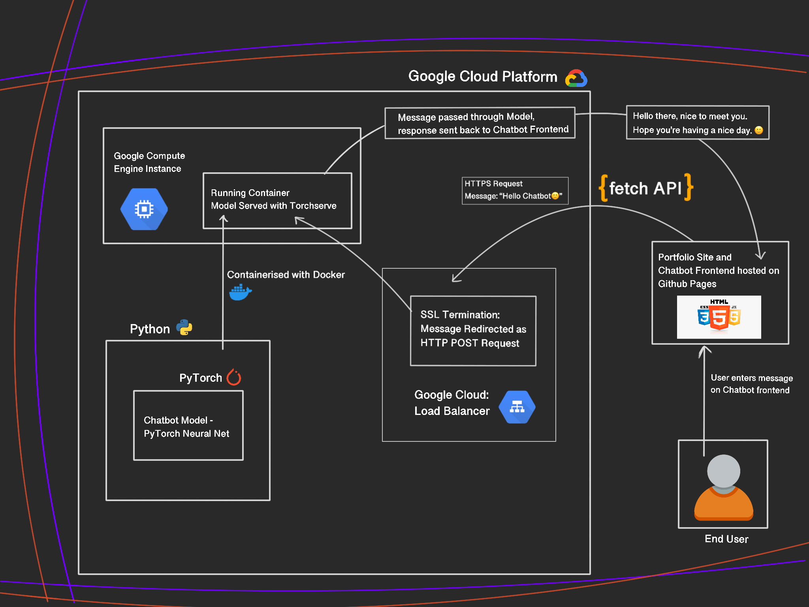

# Website-Chatbot:

### Model Flow Chart:

### Packages/Tech Used: 

- NLTK (Natural Language ToolKit) - Pre-Processing/Extracting Features from Messages data.
- Boto3 - Accessing Datasets on AWS. 
- PyTorch - Building Model.
- Docker - Packaging for deployment. 
- Torchserve - Model serving. 
- Google Cloud Platform - Model deployment and Load balancing. 

### Project Overview: 

Creating a chatbot for recruiters/employers to interact with on my portfolio wesbite. Plan is to create a chatbot that will be trained on typical questions about me: datapoints are questions and the labels are categories like: "Experience", "Hobbies", "Education" etc. When a message is receieved, the model/bot will predict which category the message belongs in and formulate a response based on some pre-determined responses for questions in this category.

This project has been cloned from my Girlfriend chatbot repo hence there will be a large overlap in terms of code. This chatbot will be deployed using Torchserve and GCP.

### Step 1: Cloning:
- Cloning my Girlfriend Chatbot

### Step 2: Creating Custom Handler:
- Initialize model and load in trained parameters. 
- Implement preprocessing, inference, postprocessing functions. 
- Add "handle" function to determine entire pipeline from datapoint to prediction. 

### Step 3: Torchserve:
- Archive model into a .MAR file. 
- Start serving the model locally using torchserve. 
- Test served model with health check and POST request. 

### Step 4: Docker:
- Create requirements.txt for model. 
- Dockerfile to package model. 

### Step 5: Fetch API:
- Setup FetchAPI into website Javascript to be able to make requests. 